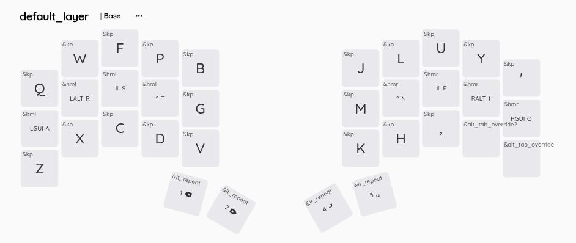
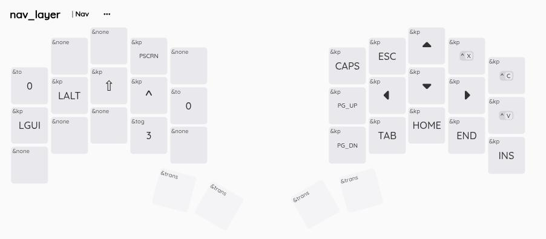
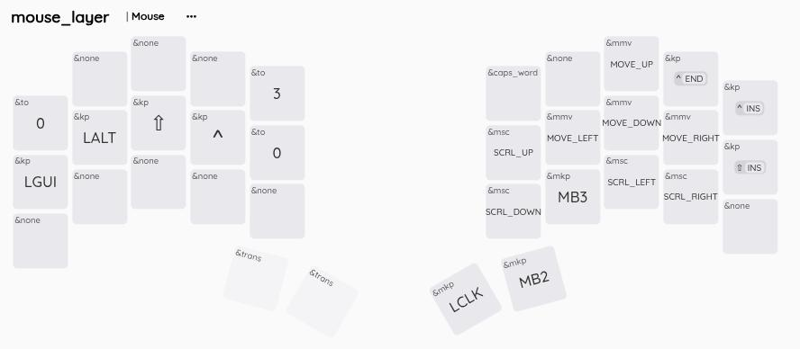
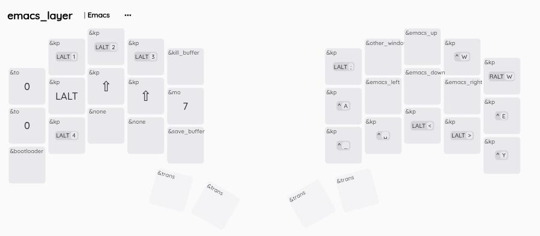
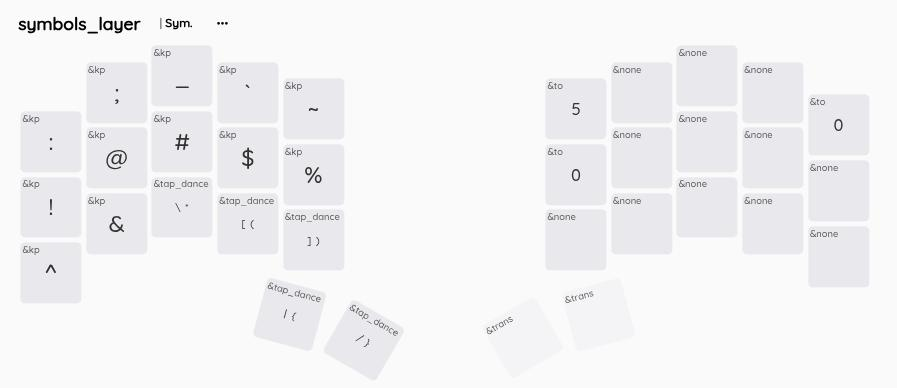
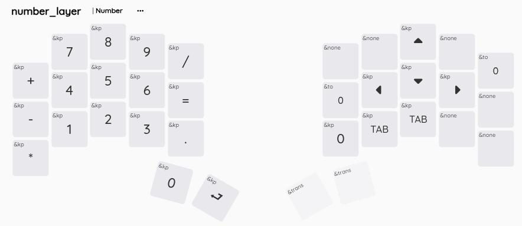
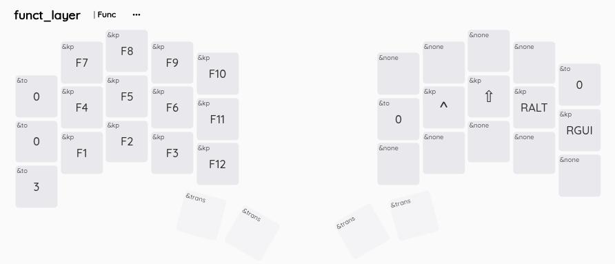

# 🐙 Urchin ZMK Firmware Configuration

This repository contains the custom **ZMK Firmware** configuration for my **Urchin** 34-key wireless split keyboard.

This configuration is maintained as a ZMK user configuration directory, designed to be built using [**GitHub Actions**](https://docs.zmk.dev/docs/development/build-with-github-actions).

---

## ✨ Features

This specific firmware configuration includes the following features:

* **Keyboard:** Urchin 34-Key Split (Designed by Duckyb, grazie).
* **MCU:** nice! nano v2 / nRF52840.
* **Dongle:** can be built with and without a dongle.
* **Layouts:** Colemak-DH alpha layer, based on Miryoku layout. Further details below.
---

## 💻 Keymap Layers

The keymap is defined in `config/urchin.keymap`.

| Layer Name | Description | Activation |
| :--- | :--- | :--- |
| **`&default`** (Base) | Primary alphanumeric and punctuation layer. | Active on boot. | Colemak-DH
| **`&nav`** (Navigation) | Arrow keys, Home, End, Page Up/Down. | 
| **`&mouse`** (Mouse) | Mouse movement, clicking, and scrolling. | 
| **`&emacs`** (Emacs) | Emacs movement, selection, mark, yank, buffer control. | 
| **`&sym`** (Symbols) | All common programming and specialized symbols. | 
| **`&numb`** (Numbers) | Numbers (0-9) | 
| **`&func`** (Function-keys) | Function keys (F1-F12). | 

These are screenshots from Nic Coutsos' wonderful keymap editor. `config/urchin.keymap` is the canonical up to date source, not these images.

   
   
  
  

 

## 🔗 Resources

* [Urchin Keyboard PCB/Hardware](https://github.com/duckyb/urchin)
* [ZMK Firmware Documentation](https://zmk.dev/)

---

## 📜 License

This configuration is open-source and released under the  MIT License.

Firmware for: [Urchin Keyboard](https://github.com/duckyb/urchin)
